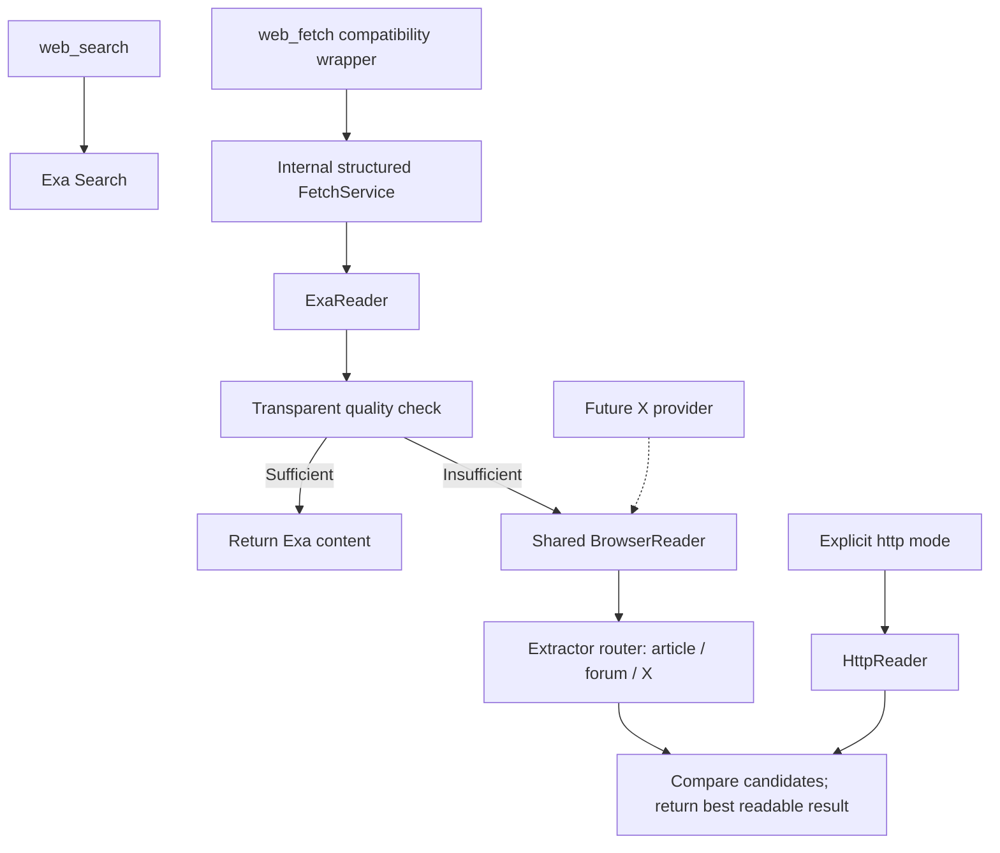

# Exa-first web fetching: architecture and isolated proof of concept

Date: 2026-10-02. Local Windows/Python 3.13 execution. No production tool,
runtime dependency, Dockerfile, NAS configuration, commit or remote was changed
in this phase. Existing uncommitted work is preserved.

Historical PoC snapshot: the subsequent implementation corrects the production
Exa adapters and adds Direct API support. See
[current Exa verification](exa-provider-verification.md). The browser decision
remains **DO_NOT_INTEGRATE_BROWSER** for general Web tools.

## Recommendation

**DO_NOT_INTEGRATE into the production server yet.**

Keep Exa as the web search/discovery provider and default fetcher. The proposed
Exa → quality check → optional shared BrowserReader architecture is coherent,
and its isolated prototype works. However, none of the four general pages
demonstrated a material content improvement requiring a browser after Exa was
called correctly. The clear improvement is still X, which required visible
Chromium in the tested configuration. Linux/Xvfb/Synology operation, generic
extraction accuracy and a long-running browser service remain unvalidated.

The immediately actionable finding is **upstream Exa schema drift**, not a
reason to replace Exa with Chromium. Correcting the existing remote argument
mapping should precede any production fallback integration.

## Existing architecture and reuse

[`server.py`](../server.py) contains:

- `call_mcp(server_url, tool_name, arguments)`: opens an MCP Client for the call,
  joins text content blocks, and raises on a remote tool error. It discards
  structured/non-text blocks and does not cache results or pool sessions.
- `call_exa(...)`: delegates to the fixed `EXA_MCP_URL`.
- `web_search(query, num_results=5) -> str`: clamps results to 1–20 and calls
  `web_search_exa` with `query` and `numResults`.
- `web_fetch(url) -> str`: calls `web_fetch_exa` with `url`.

The registered Web tools remain unchanged, including their schemas and string
return types. The older X tools are also unchanged in this phase.

[`x_public.py`](../x_public.py) provides reusable URL/public-DNS checks, an
SSRF-safe DNS-pinned HTTP design and a bounded SQLite cache implementation.
Its actual `PublicHTTP` transport intentionally restricts hosts to X and its
existing discovery source; widening that global allowlist would be wrong.
The PoC reuses `checked_url`, `public_addresses` and `Cache`, while adapting
the pinned HTTP design to generic public HTTPS URLs. Its X HTTP mode calls
the existing `FreePublicProvider`, with its cache disabled for the comparison.

There is no existing general WebReader or shared web cache to extend. The
prototype therefore lives under `tools/`, outside the provider pipeline.

## Live Exa schema finding

The keyless remote endpoint advertised these schemas via `tools/list`:

| Tool | Required/current arguments | Existing wrapper behavior |
| --- | --- | --- |
| `web_fetch_exa` | `urls: string[]`, optional `maxCharacters` (default 3000) | Sends singular `url`; verified `-32602` input validation failure for `example.com` |
| `web_search_exa` | `query` **and `objective`**, optional `numResults` | Omits required `objective`; incompatible with the observed current schema |

The search incompatibility is established from the advertised schema; the
legacy search wrapper itself was not repeatedly invoked to provoke failures.
The PoC uses the existing `call_exa` transport with `urls:[url]` and
`maxCharacters:20000`. Its one search probe supplied an explicit objective
and returned ranked Python documentation/release URLs. No account or new key
was introduced. These parameters are confined to the PoC.

The [official Exa MCP documentation](https://exa.ai/docs/get-started/exa-mcp)
identifies Exa as both search and content-fetch provider and describes keyless
rate-limited access. The observed live schema, rather than an assumed old
parameter shape, is the basis of the adapter.

## Proposed architecture and compatibility



Search and fetching remain separate. Chromium never searches Google, Bing,
DuckDuckGo or X. Discovery continues through Exa; the existing X search path
currently uses DuckDuckGo and is not silently migrated by this PoC. If X
discovery is changed later, it should reuse the Exa search adapter rather than
introduce another browser-search mechanism.

The proposed internal `fetch(url, mode="auto", refresh=False)` supports `auto`,
`exa`, `http` and `browser`. Auto tries Exa first, starts the browser only if
quality is insufficient, and preserves the better readable candidate when a
browser fails. The HTTP mode is explicit; an extra HTTP retry in every auto
request is not needed merely to add another layer.

Keep the current `web_fetch(url) -> str` wrapper in the first production step,
rendering internal structured content as Markdown. That avoids an unexpected
dict/JSON return-type change for existing clients. Optional tool parameters or
a separate structured tool can be added only in a deliberate API/schema change.
`web_search` retains its public signature and Exa semantics; only the upstream
argument mapping needs correction. No registered `web_search_and_fetch` tool
was added during this experiment.

The internal result includes URL/canonical URL, title/content, author,
publication/modification time, source, `browser_used`, `browser_attempted`,
content length, headings, links, media, tables, code, fetch time and cache state.
The quality score and attempt summaries remain inspectable.

**Readable is not verified complete.** The PoC uses `complete:false` and
`completeness:"unknown"` for readable HTML/Exa content, or `partial` for the
existing X preview. Empty failures are `unavailable`. It never derives
`complete:true` from character count, a missing error or unchanged scrolling.
Missing author/date metadata remains null. Exa's flattened Markdown cannot
recover every field that `call_mcp` discarded.

## Implemented PoC scope

[`tools/web_reader_poc.py`](../tools/web_reader_poc.py) contains duck-typed
`ExaReader`, `HttpReader`, `BrowserReader` and `FetchPipeline`. They share a
`read(url)` contract; unused provider registries or abstract base-class hierarchies
were not added. An eventual small `ContentReader` Protocol can formalize this
contract without changing it. Existing `call_exa` already serves the sole
SearchProvider, so another production transport wrapper is unnecessary.

`extract_html` is the small extractor router. The same extraction/metadata
helpers operate on downloaded HTML and a browser-rendered HTML snapshot:

- **Generic article:** semantic article body, article or main container; removes
  scripts, navigation and recognizable unrelated/advertising containers;
  extracts headings, links, media metadata, tables and code separately.
- **Forum:** recognizes Discourse metadata/post bodies and keeps visible posts
  distinct from embedded link-preview articles. It does not invent a thread end.
- **X:** isolates the requested post's body and author from other visible
  article candidates; records visible post IDs/usernames separately, excludes
  nested quotes from top-level post counts and preserves unknown relationships.

Browser extraction preserves selected rendered text and removes hidden DOM
elements. The initial parser exposed fragmented animated letters and selected
a Discourse embedded preview; both were corrected and covered by regressions.
The final generic extraction still retains some author/related-story/sidebar
text on publisher pages. It is a PoC, not a production-quality universal
readability extractor. Longer text is consequently not evidence of more article
content. No full DOM, scripts, tokens or page storage are returned to ChatGPT.

[`tools/web_reader_probe.py`](../tools/web_reader_probe.py) performs the live
comparison. Playwright and psutil come from the previously created ignored
isolated environment; production requirements were not amended. Raw results
are ignored `.venv/web-reader-*.json` files.

Example using the existing local environments:

```powershell
$env:PYTHONPATH='D:\mcp-server\.venv\x-playwright-poc\Lib\site-packages'
.venv\Scripts\python.exe tools\web_reader_probe.py --only js_news --only forum
.venv\Scripts\python.exe tools\web_reader_probe.py --only x_long --only x_thread --headed
```

The process environment override applies only to the diagnostic shell; it does
not add a requirement or change the server startup configuration.

## Quality check

The testable heuristic reports reasons for empty/very short content, leading
JavaScript/login/consent/challenge messages, metadata-only previews, possible
short X previews, dominant navigation, fragmented rendered characters,
incomplete extraction and local output truncation. Legitimately short pages
such as Example Domain can pass. Articles merely discussing login are not
automatically treated as a login wall.

Candidates are compared by adequate readability, then bounded quality score;
Exa wins exact ties. Gate/error results cannot replace a useful preview merely
because an error page has many characters. `browser_attempted:true` can coexist
with `source:"exa"` and `browser_used:false` when a browser was tried but its
content was not selected.

This is a transparent routing heuristic, not a completeness detector or a
classifier proven across the web. False positives/negatives remain possible,
especially publisher boilerplate and short legitimate X posts. Production
deployment would need additional representative fixtures and measured fallback
precision, rather than pretending this initial score is authoritative.

## Live comparison

All calls were anonymous and sequential. Browser runs used a persistent process
with fresh contexts. General pages used the default headless Chromium shell;
X used normal visible Chromium. They were separate comparison configurations,
not two simultaneous production runtimes.

Character counts exclude the Exa URL wrapper line. Exa still includes Markdown
headings, whereas HTML extraction uses text, so counts are not byte-for-byte
completeness comparisons. Timings below are uncached reader timings; final
general comparisons reused the earlier Exa results from the PoC cache to avoid
redundant remote fetches. Cached-call times were not presented as live speeds.

| Scenario / URL | Exa characters / time | HTTP characters / time | Browser characters / time | Browser requests / approximate process-tree RSS |
| --- | --- | --- | --- | --- |
| [Static Example Domain](https://example.com/) | 153 / 1.56 s | 166 / 0.09 s | 905 / 2.51 s | 2 / 412 MiB |
| [JS-heavy news publisher article](https://www.theverge.com/tech/1003877/apple-security-camera-no-video) | 2,412 / 1.40 s | 2,852 / 0.21 s | 2,699 / 2.54 s | 318 / 988 MiB |
| [Technical Cloudflare post](https://blog.cloudflare.com/18-november-2025-outage/) | 18,956 / 1.57 s | 18,065 / 0.17 s | 18,111 / 2.43 s | 65 / 710 MiB |
| [Python forum thread](https://discuss.python.org/t/python-3-13-0-final-has-been-released/66972) | 7,426 / 1.41 s | 5,882 / 0.92 s | 3,755 / 3.16 s | 116 / 726 MiB |
| [X Qwen long post](https://x.com/Alibaba_Qwen/status/1886105723047973138) | Remote call failed; no content / 1.30 s | 298 / 1.47 s | 704 / 5.53 s | 654 / 1,321 MiB |
| [X six-post thread seed](https://x.com/kchonyc/status/1978156587320803734) | Remote call failed; no content / 1.17 s | 300 / 1.56 s | 304-character main body plus six same-author visible posts / 5.62 s | 615 / 1,296 MiB |

Findings:

- Example Domain's rendered page includes additional language versions; its
  increased browser length is not a new, longer English article.
- The news site loads hundreds of JS/assets but its main article is already
  server-rendered and readable through Exa/HTTP. It is JS-heavy, **not proof of a
  JS-only article**. Some extra browser text is unrelated page UI.
- The technical post contains substantially the same narrative through all
  readers. Whitespace, Markdown and table formatting explain length differences.
- The forum browser captured one currently rendered post; Exa/HTTP returned
  more thread material. No exhaustive forum scroll/read-to-end was attempted.
- X provided the genuine advantage: a 704-character long body and the author's
  six numbered visible posts, independently separable from a foreign author.
  Reply/conversation IDs and a reliable generic end-of-thread signal remain
  absent. Same-author visibility alone is not a proven graph connection.
- The X Exa calls failed with SDK ExceptionGroup errors, even with the correct
  observed schema. Their exact service cause was not established; they must
  not be described as paid-only, globally unsupported or rate-limited without
  further evidence. The schema failure of the old wrapper is a separate finding.

The general headless pages all produced readable content. Previous isolated X
headless tests returned 403 or navigation failures; this phase reconfirmed X
content through the common engine in headed mode without attempting masking.
No login, existing profile, account cookies or captcha solution was used.

For the four general pages, auto's quality check would keep Exa. That selection
is reported from the measured candidates, not mislabeled as four separate live
auto fallback runs. One genuine auto call on Example Domain selected Exa, and
the subsequent call was cached with the original fetch timestamp. Browser
fallback, failure preservation, cache-mode separation and refresh are also
covered offline. The browser's own downstream assets and Exa's remote crawling
request counts are not directly comparable: HTTP made one document fetch;
Exa's internal crawl request count is unknown.

## News metadata

The shared HTML extractor reads canonical tags, author metadata,
`article:published_time` / `article:modified_time` and supported JSON-LD article
types. The news sample exposed author **Stevie Bonifield**, publication and
modification **2026-10-01T22:51:36+00:00**, and its canonical URL. The technical
sample exposed **2025-11-18T00:00:00.000Z** and modification
**2026-07-17T12:57:17.927Z**, but author was not captured and remains null.
These are source metadata strings, not an inference that an editorial event
occurred at midnight. The forum exposed the initial publication time; it did
not establish every reply's metadata. Exa's current flattened result provides
less directly reusable structured metadata. Missing fields should stay unknown.

## Cache and lifecycle

The existing SQLite Cache implementation is reused with a separate ignored
`.venv/web-reader-poc.sqlite3`. Keys include normalized URL, mode, extractor
version and applicable browser configuration. Adequately readable results use
a 30-minute TTL; weak readable results one minute; errors/gates are not cached.
The cache retains source, canonical URL, timestamp, content, quality and unknown
completeness. `refresh` bypasses and replaces the entry. It never upgrades a
cached preview to complete. Exa/HTTP entries need not differ between headed and
headless runs; browser/auto entries do.

Prefer a lazy persistent Chromium process with **one fresh context per fetch**,
closed in `finally`. This amortizes startup and isolates cookies/storage without
using an account. The PoC bounds browser concurrency to one. Production would
also need disconnect recovery, process recycling, idle shutdown and memory
limits. The diagnostic proxy has finite lifetime budgets; it is not an
indefinitely running production proxy.

One BrowserReader instance serves both generic pages and X. Browser mode is a
process configuration, not a per-context toggle. If headed X is enabled later,
the single shared process should be headed and backed by a separately validated
Linux display service; do not silently create a second X-only browser runtime.
If X is disabled, a shared headless process may be adequate for general pages.

## Security and request blocking

Initial URLs reject credentials, non-HTTPS schemes, nonstandard ports, local
hostnames and private/reserved IP literals. The existing all-address public-DNS
check rejects hostnames resolving to unsafe destinations. The generic HTTP
reader pins the checked IP while retaining TLS hostname/certificate validation;
each redirect re-enters the policy. DNS-thread cancellation still cannot kill
an OS resolver call already running, as in the existing reader.

Chromium is routed through a local loopback CONNECT tunnel. The proxy validates
and resolves each target, then connects to that exact public IP without a
second resolution. It does not decrypt TLS or inspect HTTP headers/bodies.
Chromium verifies the site's TLS certificate. Browser requests/redirects are
also checked by context routing; local bypass, QUIC and nonproxied WebRTC are
disabled. Service workers, WebSockets and downloads are disabled. No cookies,
tokens, Authorization headers, browser storage or full network traces are
logged. Only safe failure types, counters and extracted public content persist.

This policy avoids claiming that a Python DNS precheck alone protects a browser
that independently resolves later. The proxy still requires dedicated security
review before deployment. Exa fetching is delegated to a remote service: local
initial URL checks apply, but its redirect handling and remote DNS are not
controlled or certified by this prototype.

Request-level blocking rejects common tracking/advertising host families,
fonts and media downloads; no extension is used. Unknown trackers and scripts
necessary for rendering are not blindly blocked. Asset-manifest/XHR behavior
can still generate video-host traffic. The news sample blocked 30 requests and
X samples five. Blocking can alter rendering, so equivalence to an unrestricted
browser is not assumed.

Limits: one browser read at a time, 25-second page phase, 65-second pipeline
deadline, five HTTP redirects, 2 MiB HTML, 20,000 content characters, bounded
metadata/output, 1,000 routed requests per page, bounded CONNECT lifetimes and
transfer budgets. Context shutdown is guaranteed on cancellation. These are
PoC bounds, not a completed adversarial-browser sandbox certification.

## Search-and-fetch evaluation

`web_search_and_fetch` is useful for news/blog/forum research, provided it stays
an Exa search plus the same FetchService, not a new search engine or another
browser pool. The live search returned ranked URLs for Python release/reference
pages using the current remote schema. No combined MCP tool was registered and
no full combined live fan-out is claimed.

Proposed initial limits: search results 1–10; fetch at most three, hard maximum
five; preserve Exa ranking, validate/deduplicate URLs, fetch concurrency two,
browser concurrency one, 20,000 characters per page, 50,000 total characters
and 90 seconds for the entire operation. Return per-URL failures and truncation
with source/fetch-time metadata, not an unexplained concatenation. Stop launching
new work once time/data budgets are exhausted. Exa supports batch URL fetches;
evaluate batching with per-page attribution before making multiple MCP sessions.
Cached/refreshed contents must use the same mode-aware cache. Published/updated
times remain separate from crawl/fetch time and search ordering.

## Dependencies, overhead and necessary next changes

Measured browser launch including driver start was **0.288 s headless** and
**0.400 s headed**. The four-page headless process peaked at **987.6 MiB**;
headed X peaked at **1,321.4 MiB**. Values sum Python/driver/browser process
working sets and can double-count shared pages; they are not Linux cgroup
measurements. Later Exa/HTTP RAM readings include the already-running browser
and must not be attributed to those readers. Samples too short for the monitor
can show zero; zero is not a measured absence of memory use.

New production dependencies would be Playwright and its Python dependencies
plus Chromium and Linux OS libraries. `psutil` is diagnostic-only. Headed Linux
would additionally need a validated display service such as Xvfb. Existing
HTTP/SQLite/Exa Python dependencies can be reused. Local Windows browser
artifacts occupy about 706 MiB; expect several hundred MiB to over 1 GiB of
additional Linux image contents, but exact image growth is unmeasured.
Current `python:3.13-slim` with only `ca-certificates` is not browser-ready.

The [official Playwright Docker guidance](https://playwright.dev/python/docs/docker)
describes browser/system dependencies and nonroot/seccomp considerations.
Runtime budgets, shared memory and sandbox behavior need verification on the
actual NAS CPU/Docker platform. Do not disable the sandbox to make it launch.
No Linux/Docker/NAS experiment or deployment was performed.

Necessary production changes, only in a later approved implementation phase:

1. Correct Exa's upstream mapping (`urls`, `objective`) with compatibility tests,
   leaving public signatures/string responses intact.
2. Add the internal result/quality/cache service and retain the existing Exa
   transport; optionally introduce a small reader Protocol.
3. Harden and validate the shared browser's egress, lifecycle and extractors;
   prove an actual generic fallback benefit on a truly JS-only article.
4. Establish anonymous Linux/headed-X reproducibility, resource bounds and
   sandboxing before adding optional runtime dependencies/container components.
5. Route future X browser reads through that **same** engine, with explicit
   relationship/quote extraction and honest incomplete-thread results.
6. Add a bounded search-and-fetch tool only after structured result/error
   attribution and public schema changes are tested.

## Verification and final scope

**201 tests passed: the existing 176 plus 25 new offline PoC tests.** Existing
tests were not modified. Coverage includes unsafe URLs/private DNS, the pinned
CONNECT destination, metadata/extraction, navigation/script removal, forums,
quote deduplication, separate X main/candidate text, quality gates, bounded
payloads, auto routing, failure preservation, cache/refresh and the current Exa
argument adapter. `git diff --check` and script compilation pass.

Added executable files: `tools/web_reader_poc.py`, `tools/web_reader_probe.py`.
Added tests: `tests/test_web_reader_poc.py`. Documentation: this report and a
README link. No new MCP tool, production browser fallback, dependency change,
commit, push or NAS change was made. All earlier local changes remain uncommitted.
